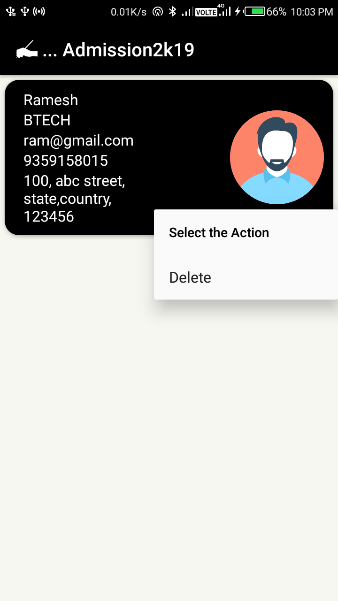

# Admission2k19-website
This accept user data from a form and stores in firebase.
[get android app source code](https://github.com/deorabanna1925/Admission2k19-android)

## Website

## App
<table style="width:100%">
    <tr>
    <td></td>
    <td></td> 
    <td></td>
  </tr>
</table>

